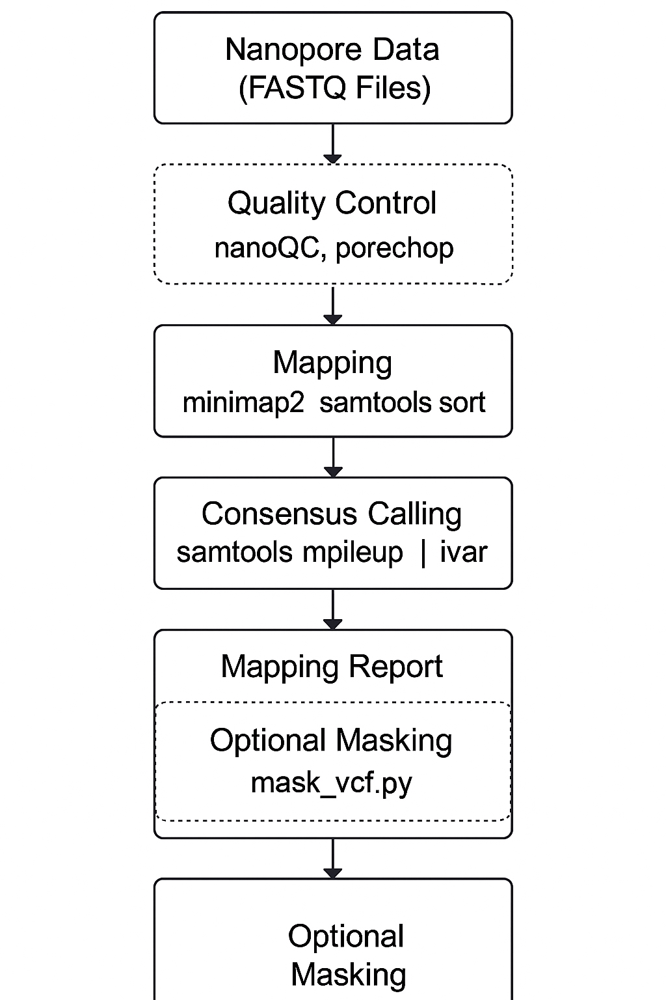

# Hantavirus Assembly Pipeline

This repository contains a standalone Python pipeline for assembling segmented Hantavirus genomes from Nanopore sequencing data. The pipeline performs quality control, mapping, consensus sequence generation, and report creation. An optional masking step is also available (requires a bed file containing primer sequences and coordinates, to date, it has not been implemented).

## Overview

The pipeline is designed specifically for Nanopore data and supports segmented genomes. For each segment (e.g., L, M, S), the tool:

- Runs quality control (QC) using **nanoQC** and **porechop**.
- Maps reads to the provided segment-specific reference using **minimap2** and sorts the output with **samtools**.
- Generates a consensus sequence with **samtools mpileup** piped to **ivar consensus**.
- Creates a CSV mapping report summarizing read mapping statistics.
- Optionally performs a masking step (via an external masking script) to produce a final FASTA assembly.

## Requirements

### External Tools

Ensure the following command-line tools are installed and available in your `PATH`:

- **nanoQC** – Quality control for raw reads.
- **porechop** – Adapter trimming for Nanopore reads.
- **minimap2** – Read mapping.
- **samtools** – BAM file manipulation and read statistics.
- **ivar** – Consensus calling.

You can install these using [Conda](https://docs.conda.io/en/latest/) from the `conda-forge` and `bioconda` channels:

```bash
conda install -c conda-forge -c bioconda nanoQC porechop minimap2 samtools ivar
```

### Python Dependencies

The pipeline requires Python 3.6+ (tested with Pytho 3.11.8) and the following libraries
- **Biopython**
- **cyvcf2**
- **pandas**

## Installation
1. **Clone the repository**

```bash
git clone https://github.com/viralemergence/SNVler.git
cd hantavirus-assembly
```

2. Install the required external tools and Python dependencies as described in the Requirements section.

## Usage 

```bash
python3 assemble_hantavirus.py \
  --input sample1.fastq sample2.fastq \
  --references Hanta_L.fasta Hanta_M.fasta Hanta_S.fasta \
  --primer_bed /path/to/primer.bed \
  --mask_script /path/to/mask_vcf.py \
  --maskfile /path/to/maskfile.txt \
  --maskvcf /path/to/mask.vcf \
  --output /path/to/output
```
### Command-Line arguments

- --input: One or more input FASTQ (or FAST5) files.
- --references: One or more reference FASTA files for each genome segment.
- --primer_bed: (Optional) Primer BED file for trimming/mapping.
- --mask_script: (Optional) Path to the masking script (e.g., mask_vcf.py).
- --maskfile: (Optional) Mask file for the primer scheme.
- --maskvcf: (Optional) VCF file for masking.
- --skip_qc: (Optional) Flag to skip the quality control steps.
- --skip_masking: (Optional) Flag to skip the masking step.
- --output: Output directory where results will be stored.

## Pipeline Workflow

1. **Quality Control (QC):**
- Runs **nanoQC** on each input.
- Trims reads using **porechop**
- _Optional:_ Skip QC using the --skip-qc flag.

2. **Mapping:**
- Maps reads against each provided segment reference using **minimap2**.
- Converts and sorts the mapping output with **samtools** to produce sorted BAM files.

3.	Consensus Calling:
- Generates consensus sequences from each sorted BAM using samtools **mpileup piped** to **ivar consensus**.

4.	Mapping Report:
- Creates a CSV report that summarizes the number and percentage of mapped reads for each sample.
	
5.	Optional Masking:
- If masking parameters are provided and the --skip_masking flag is not set, the pipeline will run an external masking script to produce a final assembled FASTA.

## Pipeline Diagram

